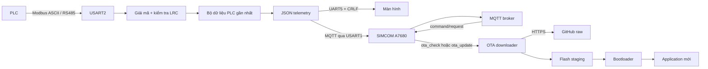

# WBEE MobiFone Firmware

Firmware cho thiết bị giám sát nước dùng `STM32F103RET6`, modem `SIMCOM A7680`, PLC qua `RS485/Modbus ASCII`, màn hình qua UART và MQTT để trao đổi dữ liệu với server.

Nhánh này có hỗ trợ OTA qua GitHub. Application được liên kết tại `0x08008000` và chạy phía sau bootloader 32 KiB.

## Chức năng chính

- Nhận dữ liệu PLC thụ động qua `USART2`, không gửi lệnh yêu cầu PLC.
- Kiểm tra địa chỉ, function code, cấu trúc frame và LRC trước khi nhận dữ liệu.
- Giữ giá trị PLC gần nhất; chỉ chuyển các trường telemetry về `null` khi quá thời gian không nhận được frame hợp lệ.
- Kết nối MQTT qua SIMCOM, publish trạng thái, cấu hình và telemetry.
- Gửi JSON telemetry sang màn hình qua `UART5`.
- Nhận yêu cầu OTA từ MQTT, tải manifest và firmware từ GitHub, kiểm tra CRC32 rồi giao cho bootloader cài đặt.
- Vẫn giữ chế độ đọc cảm biến trực tiếp để có thể chọn bằng `SENSOR_DATA_SOURCE`.

## Luồng tổng thể



Khi khởi động, firmware đi qua các trạng thái:

```text
Off -> On -> InternetReady -> MqttReady -> Subscribed
```

Sau khi subscribe thành công, thiết bị publish lần lượt `status=online`, `config/state` và một bản telemetry. TIM6 tạo nhịp 1 giây; khi đủ chu kỳ cấu hình, vòng lặp chính publish telemetry mới.

## Phần cứng và UART

| Cổng | Cấu hình hiện tại | Chức năng |
|---|---|---|
| `USART1` | 115200, 8N1 | AT command, HTTP, MQTT với SIMCOM |
| `USART2` | 9600, 8E1 | Nhận Modbus ASCII từ PLC |
| `UART4` | 9600, 8N1 | Cảm biến trực tiếp khi chọn chế độ tương ứng |
| `UART5` | 9600, 8N1 | Gửi JSON sang màn hình và nhận cấu hình cục bộ |

Log `printf()` hiện được chuyển qua ITM/SWO trong `_write()`.

## Cấu hình quan trọng

Cấu hình tập trung tại `Core/Inc/config.h`:

```c
#define VERSION_WBEE "..."
#define SERIAL_NUMBER "wb000002"
#define SIMCOM_MODEL a7680

#define SENSOR_SOURCE_DIRECT 0
#define SENSOR_SOURCE_PLC_RS485 1
#define SENSOR_DATA_SOURCE SENSOR_SOURCE_PLC_RS485

#define PLC_RS485_TIMEOUT_SEC 300
#define INTERVAL_PUPLISH_DATA 15
```

Trước khi build cho thiết bị mới, cần kiểm tra:

1. `VERSION_WBEE` đúng với firmware chuẩn bị phát hành.
2. `SERIAL_NUMBER` là serial mặc định khi Flash chưa có cấu hình runtime.
3. Broker, tài khoản MQTT và `FARM` đúng môi trường triển khai.
4. `SENSOR_DATA_SOURCE` đúng nguồn dữ liệu thực tế.
5. Linker script của application là `STM32F103RETX_OTA_APP.ld`.

Không đưa mật khẩu MQTT thật vào repository công khai. Firmware hiện dùng MQTT TCP cổng `1883`, chưa mã hóa TLS.

## Dữ liệu PLC RS485

### Định dạng truyền

PLC gửi **Modbus ASCII**, tức là chuỗi ký tự hex, bắt đầu bằng `:` và thường kết thúc bằng byte `CR LF`:

```text
:021000000008100046002D000B03E8004D0004000200100A\r\n
```

`CR LF` phải là hai byte `0x0D 0x0A`, không phải chữ `#CR#LF`. Code cũng chấp nhận frame không có dấu `:` hoặc không có `CR LF` nếu toàn bộ frame nằm trong một lần nhận UART.

LRC hợp lệ khi tổng modulo 256 của tất cả byte từ địa chỉ đến byte LRC bằng `0x00`. Frame sai LRC bị loại và không reset timeout PLC.

### Ánh xạ thanh ghi

| Địa chỉ | Telemetry key | Quy đổi hiện tại |
|---:|---|---|
| `0x0000` | `ph1` | raw / 10 |
| `0x0001` | `ph2` | raw / 10 |
| `0x0002` | `do` | raw |
| `0x0003` | `ozone` | raw |
| `0x0004` | `pressure_o2` | raw |
| `0x0005` | `input_x` | vị trí bit 1 đầu tiên, tính từ bit 0 |
| `0x0006` | `output_1` | vị trí bit 1 đầu tiên, tính từ bit 0 |
| `0x0007` | `output_2` | vị trí bit 1 đầu tiên, tính từ bit 0 |
| `0x0009` | `error_code` | vị trí bit 1 đầu tiên, tính từ bit 0 |
| `0x0020` | `turbidity` | raw |
| `0x0021` | `temp_data_1` | raw |
| `0x0022` | `temp_data_2` | raw |
| `0x0023` | `temp_data_3` | raw |

Ví dụ `0x0004` có bit 2 bật nên thiết bị gửi giá trị `2`. Nếu nhiều bit cùng bật, code hiện tại chỉ lấy bit có chỉ số nhỏ nhất.

Các frame mẫu:

```text
:021000000008100046002D000B03E8004D0004000200100A\r\n
:021000200004080014000100020003A8\r\n
:02100009000102000AD8\r\n
```

Hai frame dữ liệu đầu tạo ra các giá trị `ph1=7.0`, `ph2=4.5`, `do=11`, `ozone=1000`, `pressure_o2=77`, `input_x=2`, `output_1=1`, `output_2=4`, `turbidity=20` và ba trường dự phòng `1, 2, 3`. Frame cuối cập nhật `error_code=1` vì `0x000A` có bit 1 và bit 3 bật.

### Timeout PLC

Mỗi frame hợp lệ reset bộ đếm timeout. Trong thời gian chưa quá `PLC_RS485_TIMEOUT_SEC`, thiết bị tiếp tục publish giá trị gần nhất. Khi quá 300 giây không có frame hợp lệ:

- PLC được đánh dấu offline.
- Tất cả cờ `has_*` bị xóa.
- Telemetry và JSON gửi LCD dùng `null` cho các trường PLC.
- Log xuất hiện một lần: `PLC RS485 timeout: no data for 300 seconds`.

## MQTT

Topic được tạo từ:

```text
<FARM>/<SERIAL_NUMBER>/<suffix>
```

Với `FARM=mobi/water` và `SERIAL_NUMBER=wb000002`, các topic là:

| Topic | Hướng | QoS | Retain | Mục đích |
|---|---|---:|---:|---|
| `mobi/water/wb000002/status` | Device -> Server | 0 | 1 | Online/offline và Last Will |
| `mobi/water/wb000002/telemetry` | Device -> Server | 0 | 0 | Dữ liệu cảm biến định kỳ |
| `mobi/water/wb000002/config/state` | Device -> Server | 0 | 1 | Chu kỳ cấu hình hiện tại |
| `mobi/water/wb000002/config/response` | Device -> Server | 0 | 0 | API response đã có, chưa được gọi trong luồng hiện tại |
| `mobi/water/wb000002/command/response` | Device -> Server | 0 | 0 | ACK lệnh OTA và phản hồi command |
| `mobi/water/wb000002/config/set` | Server -> Device | 0 | - | Đã subscribe; chưa có parser cấu hình MQTT hoàn chỉnh |
| `mobi/water/wb000002/config/get` | Server -> Device | 0 | - | Đã subscribe; chưa có handler phản hồi hoàn chỉnh |
| `mobi/water/wb000002/command/request` | Server -> Device | 0 | - | Lệnh điều khiển và kích hoạt OTA |

### Telemetry payload

```json
{
  "device_id": "wb000002",
  "firmware_version": "3.1",
  "ph1": 7.0,
  "do": 11.0,
  "ph2": 4.5,
  "turbidity": 20.0,
  "ozone": 1000.0,
  "pressure_o2": 77.0,
  "temp_data_1": 1.0,
  "temp_data_2": 2.0,
  "temp_data_3": 3.0,
  "input_x": 2,
  "output_1": 1,
  "output_2": 4,
  "error_code": 1,
  "rssi": -51
}
```

Các trường PLC có thể là `null`. `rssi` là dBm được quy đổi từ `AT+CSQ`.

### Status và config state

Online:

```json
{"device_id":"wb000002","status":"online","firmware_version":"3.1","rssi":-51}
```

Last Will/offline:

```json
{"device_id":"wb000002","status":"offline"}
```

Config state:

```json
{"device_id":"wb000002","telemetry_interval_s":15,"sensor_sample_interval_s":10}
```

## Đổi serial number từ server

Server gửi command đến topic đang dùng của thiết bị:

```text
mobi/water/<SERIAL_NUMBER_CU>/command/request
```

Payload:

```json
{
  "request_id": "req-serial-001",
  "command": "set_serial_number",
  "serial_number": "wb000003"
}
```

Serial hợp lệ phải dài từ 3 đến 23 ký tự và chỉ gồm chữ thường `a-z`, số
`0-9`, dấu `-` hoặc `_`.

Luồng xử lý:

1. Thiết bị kiểm tra serial mới.
2. Thiết bị ACK trên topic serial cũ:

```json
{"request_id":"req-serial-001","command":"set_serial_number","result":"received"}
```

3. Nếu ACK thành công, thiết bị ghi serial mới cùng CRC vào Flash config tại
   `0x0807F800`.
4. Thiết bị phản hồi kết quả trên topic serial cũ:

```json
{"request_id":"req-serial-001","command":"set_serial_number","result":"success"}
```

5. STM32 reset, đọc serial mới từ Flash và kết nối lại với:

```text
Client ID: mobi-wb000003
Topic:     mobi/water/wb000003/...
```

Nếu serial không hợp lệ, thiết bị không ghi Flash và phản hồi:

```json
{"request_id":"req-serial-001","command":"set_serial_number","result":"rejected","error_code":"INVALID_SERIAL_NUMBER"}
```

Nếu ghi Flash lỗi, `result` là `failed` với `error_code` bằng
`FLASH_WRITE_FAILED`. Nếu không gửi được ACK `received` sau ba lần thử, thiết
bị giữ nguyên serial cũ và không reboot.

`SERIAL_NUMBER` trong `config.h` chỉ còn là giá trị nhà máy/fallback. Serial lưu
trong Flash được ưu tiên và vẫn được giữ qua các lần OTA vì bootloader không xóa
trang config.

## Màn hình UART5

Cứ khoảng 6 giây, firmware tạo cùng cấu trúc JSON telemetry và gửi qua UART5. Hàm gửi tự bổ sung `\r\n` nếu payload chưa có kết thúc dòng.

RSSI trong bản LCD dùng giá trị gần nhất và không gọi lại `AT+CSQ`. JSON được chứa trong buffer 700 byte.

## OTA qua GitHub

### Kích hoạt

Server publish lên topic:

```text
mobi/water/<SERIAL_NUMBER>/command/request
```

Payload chỉ cần chứa một trong hai chuỗi:

```text
ota_check
ota_update
```

Hai chuỗi hiện có cùng hành vi: nếu manifest có phiên bản lớn hơn `VERSION_WBEE`, thiết bị tải và chuẩn bị cài firmware.

Trước khi bắt đầu HTTP OTA, thiết bị publish ACK lên
`mobi/water/<SERIAL_NUMBER>/command/response`:

```json
{"request_id":"req-123","command":"ota_update","result":"received"}
```

Nếu request không có `request_id`, trường này được gửi dưới dạng chuỗi rỗng. ACK
được thử tối đa ba lần; OTA vẫn tiếp tục nếu cả ba lần publish thất bại.

### Manifest

`ota/manifest.json` gồm:

```json
{
  "version": "3.0",
  "device": "wbee-stm32f103ret6",
  "app_addr": "0x08008000",
  "size": 75184,
  "crc32": "0xCE898D61",
  "bin_url": "https://raw.githubusercontent.com/.../ota/wbee_v3.0.bin"
}
```

`size` là số byte chính xác của file BIN. Thiết bị kiểm tra `device`, địa chỉ application, giới hạn vùng Flash, HTTP content length và CRC32 trước khi ghi metadata pending.

### Bố trí Flash

| Vùng | Địa chỉ | Kích thước |
|---|---:|---:|
| Bootloader | `0x08000000` | 32 KiB |
| Application | `0x08008000` | tối đa 224 KiB |
| OTA staging | `0x08040000` | 252 KiB |
| OTA metadata | `0x0807F000` | 2 KiB |
| Config | `0x0807F800` | 2 KiB |

Sau khi download thành công, application reset MCU. Bootloader kiểm tra metadata và CRC, xóa vùng application, sao chép firmware từ staging sang `0x08008000`, kiểm tra lại CRC và vector table, xóa metadata rồi nhảy vào application.

## Build và nạp lần đầu

### Application

Import project vào STM32CubeIDE và build `Debug` hoặc `Release`. Cả hai cấu hình hiện dùng:

```text
STM32F103RETX_OTA_APP.ld
```

Output chính:

```text
Debug/wbee_stm32f103ret6.elf
Debug/wbee_stm32f103ret6.hex
```

Có thể build bằng terminal nếu toolchain đã sẵn sàng:

```powershell
make -C Debug clean
make -C Debug
```

### Bootloader

```powershell
powershell -ExecutionPolicy Bypass -File tools/build_bootloader.ps1
```

Output:

```text
Bootloader/build/wbee_bootloader.hex
```

Lần nạp nhà máy:

1. Nạp `Bootloader/build/wbee_bootloader.hex` bằng STM32CubeProgrammer.
2. Nạp application đã liên kết tại `0x08008000`.
3. Reset thiết bị và kiểm tra log kết nối SIMCOM/MQTT.

Không dùng `STM32F103RETX_FLASH.ld` cho firmware OTA vì linker đó đặt application tại `0x08000000`, chồng lên bootloader.

## Phát hành OTA

1. Tăng `VERSION_WBEE` trong `Core/Inc/config.h`.
2. Clean và build lại application.
3. Tạo BIN và manifest bằng đúng phiên bản vừa compile:

```powershell
python tools/prepare_ota_manifest.py `
  --firmware Debug/wbee_stm32f103ret6.hex `
  --version 3.2
```

4. Commit và push đồng thời `ota/wbee_v3.2.bin` cùng `ota/manifest.json`.
5. Mở raw URL để xác nhận manifest và BIN đã tồn tại.
6. Publish lệnh OTA qua MQTT.
7. Sau reboot, kiểm tra `firmware_version` trong telemetry.

Tham số `--version` chỉ đặt tên file và ghi manifest; nó không thay đổi `VERSION_WBEE` đã compile trong firmware. Luôn clean/build sau khi đổi phiên bản.

## Cấu trúc source

| File/thư mục | Trách nhiệm |
|---|---|
| `Core/Src/main.c` | Khởi tạo phần cứng, timer và vòng lặp chính |
| `Core/Src/common_simcom.c` | State machine SIMCOM và điều phối publish |
| `Core/Src/cfg_store.c` | Lưu cấu hình bơm và serial runtime vào Flash |
| `Core/Src/mobi_mqtt.c` | MQTT topic, JSON và AT command MQTT |
| `Core/Src/plc_rs485.c` | Decode Modbus ASCII, LRC, mapping register và timeout |
| `Core/Src/convert_data_uart.c` | Callback UART, dữ liệu SIMCOM, PLC, LCD và trigger OTA |
| `Core/Src/ota_update.c` | HTTP GitHub, kiểm tra manifest/BIN và ghi staging |
| `Bootloader/bootloader_main.c` | Cài image pending và nhảy vào application |
| `Core/Src/sensor.c` | Đọc cảm biến trực tiếp khi không dùng PLC |
| `Core/Src/update_data_sreen.c` | Hỗ trợ giao tiếp màn hình |
| `Core/Inc/config.h` | Cấu hình build chính |

## Tài liệu chi tiết

- [MQTT và dữ liệu](docs/iot/wbee/implementation.md)
- [Luồng hoạt động](docs/iot/wbee/flow.md)
- [Lỗi và tình huống biên](docs/iot/wbee/exceptions.md)

## Hạn chế hiện tại

- Parser PLC xử lý dữ liệu của từng callback UART; chưa có bộ đệm ghép một frame bị chia qua nhiều callback.
- Các topic `config/set` và `config/get` đã subscribe nhưng chưa có parser MQTT hoàn chỉnh.
- Điều khiển motor vẫn dựa vào vị trí ký tự trong phản hồi SIMCOM, chưa parse topic/payload bằng JSON.
- `ota_check` và `ota_update` chưa được tách thành check-only và update.
- Không có rollback tự động nếu application mới hợp lệ về vector/CRC nhưng lỗi khi chạy.
- MQTT cổng 1883 và HTTPS OTA đang cấu hình SIMCOM với xác thực chứng chỉ bị tắt.
