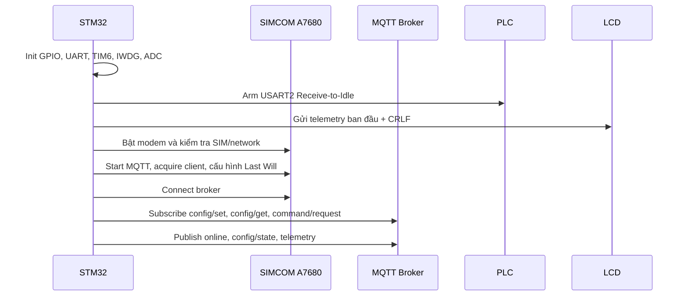
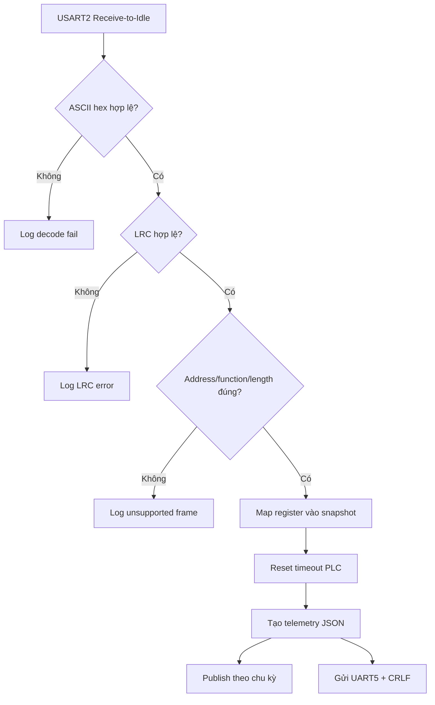
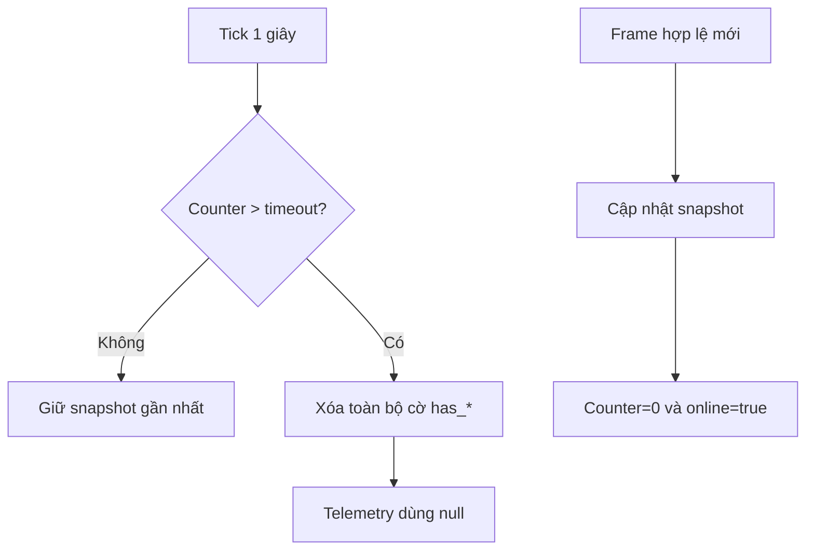
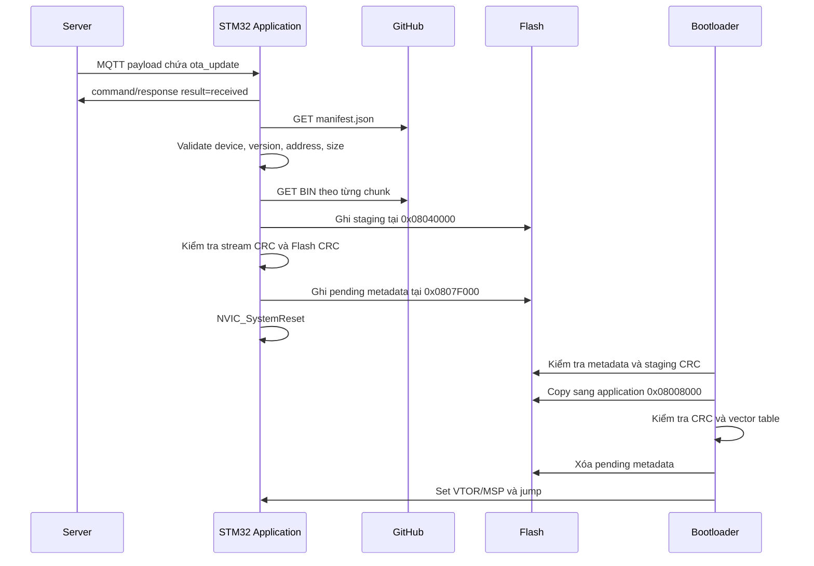
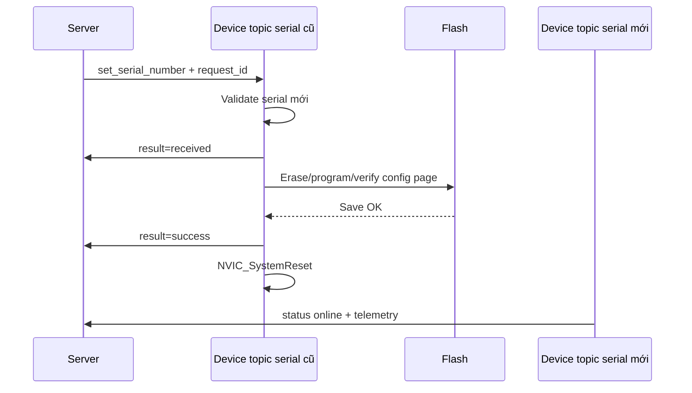

# WBEE Runtime Flow

## Khởi động và MQTT



State machine chính:

```text
Off -> On -> InternetReady -> MqttReady -> Subscribed
```

## PLC đến MQTT và LCD



PLC chủ động gửi. STM32 không polling PLC. Các frame start address khác nhau cùng cập nhật vào một snapshot.

## Công việc định kỳ

TIM6 tạo tick 1 giây:

1. Tăng bộ đếm publish MQTT.
2. Tăng bộ đếm cập nhật LCD.
3. Gọi `plc_rs485_tick_1s()`.
4. Khi đủ `INTERVAL_PUPLISH_DATA`, đặt cờ publish.
5. Vòng lặp chính publish telemetry; thao tác AT command không chạy trong ISR.
6. Khi counter LCD lớn hơn 5, gửi JSON qua UART5.

## Timeout PLC



## OTA



Nếu manifest không mới hơn, application tiếp tục chạy. Bootloader hiện không có rollback image thứ hai.

## Đổi serial number



Nếu ACK `received` không gửi được sau ba lần, serial không được ghi. Khi ghi
thành công, serial cũ vẫn được dùng để gửi `success`; serial mới chỉ có hiệu lực
sau reboot.
